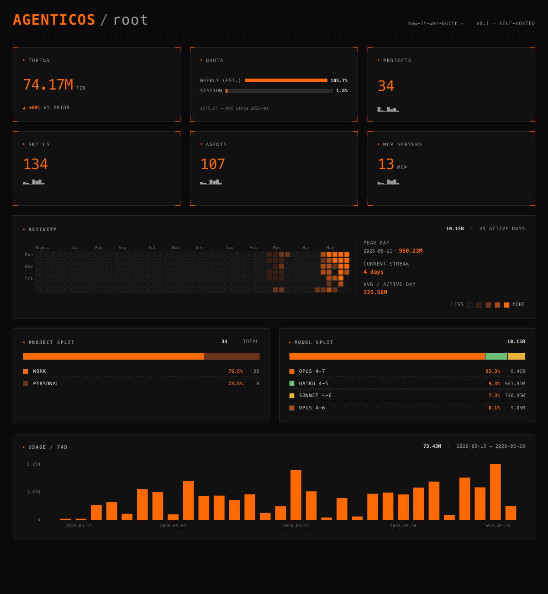
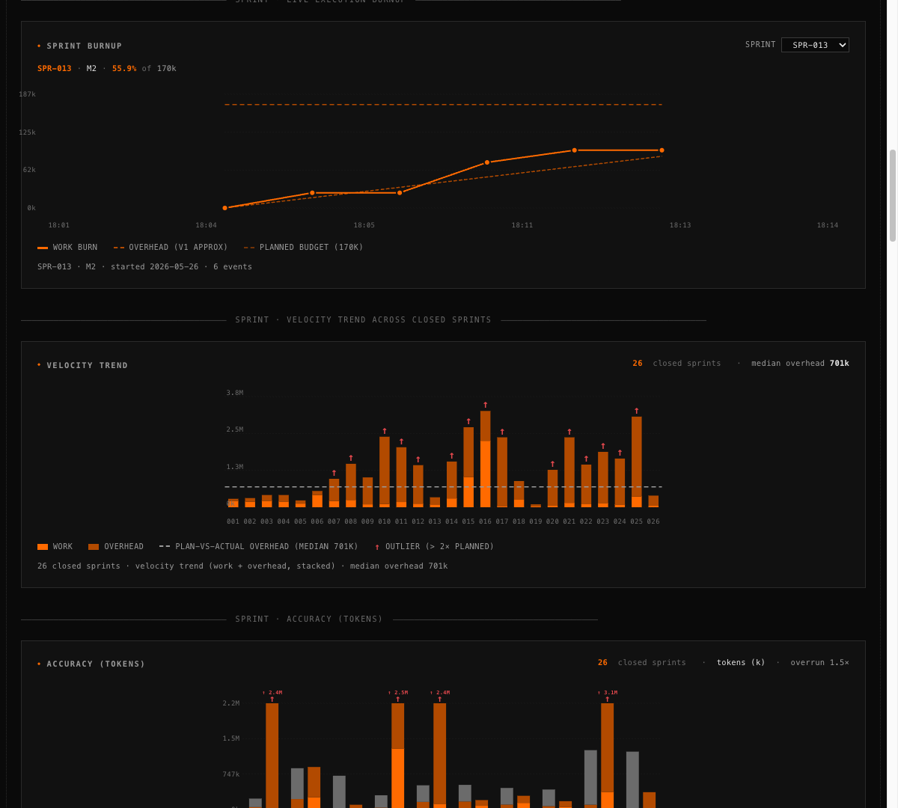

# AgenticOS PMO

Obsidian-native PM workspace + methodology that drives the build of [AgenticOS](https://github.com/SethMK/agenticos). Replaces story-point fiction with **measured calibration** anchored to actual sub-agent token + time runs.



The public `/` dashboard this PMO drives — tokens burned, projects, skills, agents, activity heatmap, model split. Every number is measured from real runs, not estimated.




The `/how-it-was-built` view — 106 stories / 93 shipped / 15 epics, plus the sprint cycle's burnup, velocity trend, and estimate-accuracy charts.

## What it is

A kanban + story decomposition workspace built natively in Obsidian, that an orchestrator (Claude Code session) reads + writes to drive single-story-at-a-time agentic builds.

Not a SaaS, not a hosted tool. A **rule set + file structure + agent contract** that any team can fork into their own Obsidian vault.

## Mental model

The agentic orchestrator runs the work. This vault is the **planning surface** the orchestrator + curator agent read + update.

- `boards/kanban.md` — the live board (5 columns)
- `product/` — PRD, goals, founding plan
- `epics/` — epic-level scope
- `stories/` — 1-3 point story files with structured front-matter
- `ceremonies/standups/` — daily progress notes (auto-written by curator agent)
- `exports/` — sanitised public-facing kanban + sample stories for `/how-it-was-built` view

## Story state machine

```
Backlog → Ready → In Progress → Review → Done
```

Single-story-at-a-time by default. Work-in-progress is decided per-pull by file-overlap analysis — a second card runs in parallel only when the two stories touch disjoint files. Each transition is logged by the `pm-curator` agent.

## Calibration table

v3 prices a story by the **shape of its verification protocol**, not its code surface area. A one-line CSS fix that still needs a cold rebuild + Playwright pass costs the same ~130k-token floor as a small feature with the same protocol. Minutes are wall-clock from card-pull to Done.

| Bucket | Tokens | Wall-clock | Agents | Shape |
|---|---|---|---|---|
| **S-inline** | 5–30k | 1–5 min | 1 | Orchestrator-inline edit + grep; no QA pair (single-file CSS/constant, front-matter flip) |
| **S-with-QA** | 100–160k | 4–8 min | 2 | One-file fix + implementer+QA pair (cold-rebuild + Playwright) |
| **M-data** | 120–160k | 3–8 min | 2 | Single pipeline step + attribution-coverage QA across the JSONL |
| **M-frontend** | 80–120k | 3–8 min | 2 | One component or surgical page edit + Playwright QA |
| **M-frontend (cross-window)** | 200–250k | 4–12 min | 2 | Same, but handed off PMO → build repo (+coordination cost) |
| **M-agent-def** | 120–160k | 3–8 min | 2 | New `.claude/` agent or hook + spec-compliance QA + dry-run |
| **L-single** | 160–220k | 8–14 min | 2 | Hairy single component + Playwright QA |
| **Spike** | 80–150k | 5–12 min | 1–2 | Exploration + variants + recommendation; no commit expected |

**Floor: ~130k tokens** for any story whose protocol includes a cold rebuild + Playwright pass — regardless of how few lines changed. Each sub-agent spawn also pays a ~100–125k system-prompt floor, so "just parallelise it" is rarely cheaper at this task size. Calibration replaces estimation theatre with measured reality: every number above is re-derived from logged token + time runs, not guessed.

## Sprint cycle

Work runs in **1-hour time-boxed sprints**. Two ideas keep them honest:

- **MoSCoW-lite.** Each sprint locks a small set of **must-ship** stories (the success bar) and lists **should-ship** ones that get dropped without ceremony if the must-haves eat the budget. A sprint succeeds only if every must-have ships.
- **Two budgets, tracked separately.** Every sprint reports **work** tokens (stories + improvements) and **overhead** tokens (planning + close + retro) as two distinct numbers. Overhead lives *outside* the work budget on purpose — so there's never an incentive to skip the retrospective to make the burn look cheaper.

Token spend is checked at four tripwires during execution (50% info · 75% warn · 85% drop should-haves · 100% hard-stop). The `/how-it-was-built` dashboard charts all of it live: a **sprint burnup** (work vs overhead vs planned budget), a **velocity trend** across every closed sprint, and **estimate-accuracy** bars comparing planned vs actual.

## Reusable patterns

The workspace codifies four patterns that generalise to any multi-agent build:

1. **File-ownership contracts** — each sub-agent reads specific files, writes specific outputs, never cross-edits another agent's territory.
2. **Hand-off markers** — explicit STOP at end of each agent's run. Main thread approves before the next agent fires.
3. **Approval gates** — manual review checkpoints for design-dependent or high-confidence outputs.
4. **Verification logs** — every step writes a structured note for downstream agents (creates audit trail + debuggability).

## First-time setup (if you fork the pattern)

Open the vault in Obsidian. Install three community plugins:

- **Kanban** by mgmeyers — required for `boards/kanban.md`
- **Tasks** by schaeser — task queries inside story files
- **Dataview** — table queries over story front-matter

## Code

Code lives in a private repo. This public README documents methodology + agent contract.

Sister repo: [agenticos](https://github.com/SethMK/agenticos) — the actual build this PMO drives.

---

Built by [Marcin Kokott](https://linkedin.com/in/marcinkokott) — Head of Product & Delivery, Vazco.
