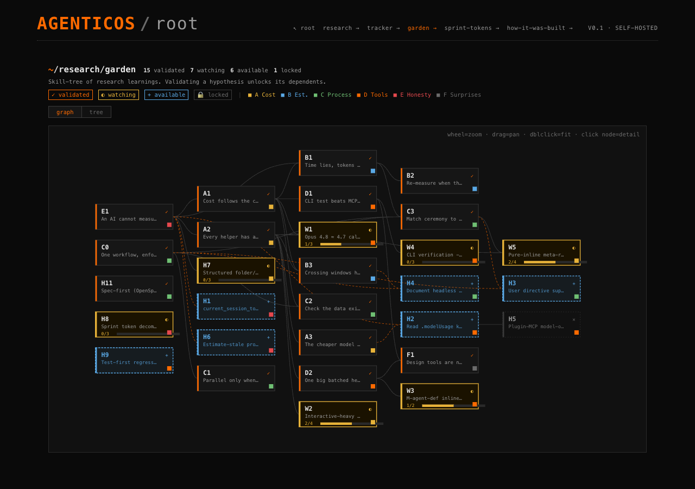
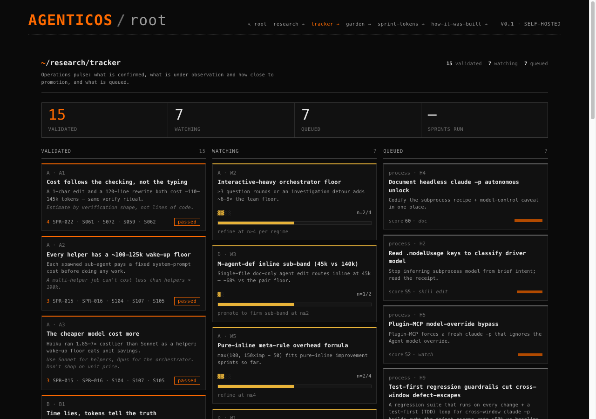
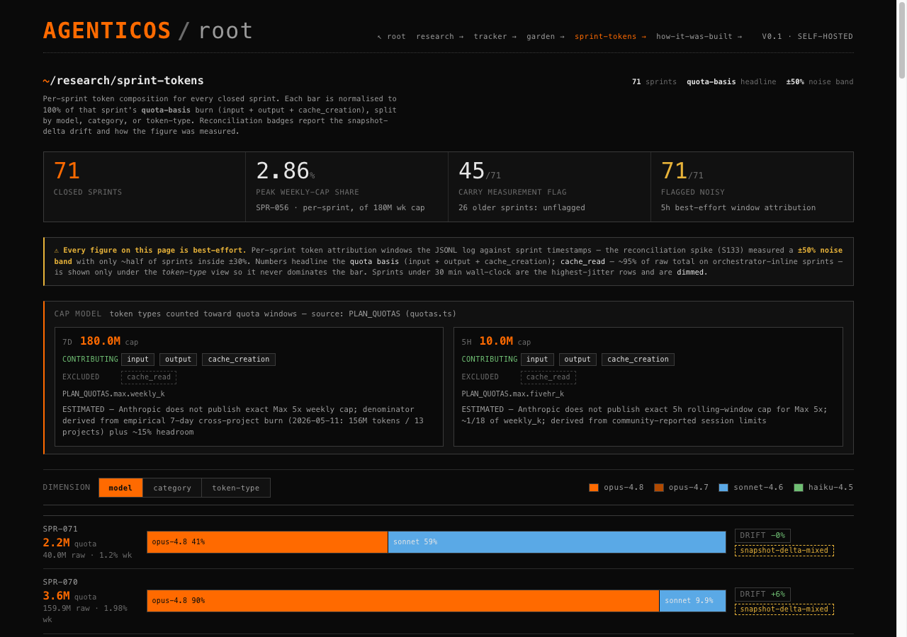

# AgenticOS PMO

The Obsidian-native PM workspace + methodology that drove an AI-native product from idea to a live dashboard — and the research ledger that caught the agent self-reports running **4–6× under** true cost. Live build: **[agenticos.sethsendom.com](https://agenticos.sethsendom.com)**.

It replaces story-point fiction with **measured calibration** anchored to real sub-agent token + time runs, runs the work in **one-hour sprints**, and treats every learning as a **falsifiable hypothesis** with a measured baseline.


The `/how-it-was-built` view this PMO renders — **171 stories / 148 shipped / 25 epics**, three milestones shipped (M1–M3), across **71 one-hour sprints**.

## The problem

Build a real, shipping product **solo, with AI sub-agents, under a hard weekly token quota** — and do it without the usual self-deception:

- **Story points are fiction.** "3 points" tells you nothing about what a story will actually cost.
- **You can't see your own ceiling.** Claude's weekly quota is a percentage dial with no token number, so you only learn the window closed *after* it closed.
- **Cost isn't what the agent says it is.** A sub-agent's self-report counts billed tokens only; real compute runs multiples higher.
- **Agents fabricate.** A sub-agent will report a file write it never made — often enough that every claimed write earns a deterministic grep check.

## The solution

A planning workspace — not a SaaS, just a **rule set + file structure + agent contract** you can fork into any Obsidian vault — that answers each of those with a measured discipline:

1. **Calibration, not estimation.** Every story is priced by the *shape of its verification protocol* (calibration v3). A cold rebuild + Playwright pass is a ~130k-token floor whether you changed one line or fifty. Numbers are re-derived from logged runs, never guessed.
2. **One-hour sprints, two budgets, MoSCoW-lite.** Each sprint locks a small set of **must-ship** stories (the success bar) and lists **should-ship** ones dropped without ceremony if the must-haves eat the budget. **Work** tokens and **overhead** tokens (planning + retro) are tracked as two separate numbers — so there's never an incentive to skip the retro to make the burn look cheap. Four tripwires fire during execution (50% info · 75% warn · 85% drop should-haves · 100% hard-stop).
3. **Baseline-first research.** No learning becomes *validated* without a measured before/after delta and a no-regression guard. `refuted` is a first-class outcome. (More below.)
4. **Process enforced, not remembered.** The rules that matter — verify every sub-agent write by grep, spawn a separate QA agent on every cross-window hand-off, gate subprocess completion on turn-count — are deterministic checks, not prompt reminders.


The public `/` dashboard this PMO drives — every number measured from real runs, not estimated.

## Research, made public

The PMO runs a **baseline-first hypothesis ledger**. Every claim records a measured current-state baseline *before* it's allowed into observation, and a measured delta *before* it can validate. Four findings that shaped the build:

- **Prototyping first is the single biggest cost lever.** A pixel-honest prototype absorbs the geometry and feasibility unknowns up front. Same-session proof: a prototyped page landed **95% under budget**; an un-prototyped page of the same shape ran **146% over**.
- **Measuring the baseline kills bad ideas before you build them.** We nearly built a code-search index to save tokens — then measured that search and navigation is only **~8% of all tokens**, half the eyeball guess. The intervention couldn't have paid off. The measurement *was* the deliverable.
- **An AI cannot measure its own effort.** Agents self-reported 14–22k tokens when the true metered cost was 85–98k — **4–6× under**. The billing meter is the authority; the agent's own introspection is blind. (This is the ledger's one *critical*-severity finding.)
- **Spec-first earned a confident GO.** Building milestone pages against an OpenSpec change kept acceptance mechanically checkable — and recovered verification when a headless build driver crashed mid-run. Traceability up, tokens neutral.

Browse the live research surface: **[explorer](https://agenticos.sethsendom.com/research/explorer)** (faceted + scatter) · **[tracker](https://agenticos.sethsendom.com/research/tracker)** (validated / watching / queued) · **[garden](https://agenticos.sethsendom.com/research/garden)** (skill-tree) · **[sprint-tokens](https://agenticos.sethsendom.com/research/sprint-tokens)** (per-sprint decomposition).





## Mental model

The agentic orchestrator runs the work. This vault is the **planning surface** the orchestrator + curator agent read and update.

- `boards/kanban.md` — the live board (5 columns)
- `product/` — PRD, goals, founding plan
- `epics/` + `milestones/` — epic and milestone scope
- `stories/` — 1–3 point story files with structured front-matter
- `ceremonies/` — standups, sprints, retros (written during sprint ceremonies)
- `notes/research/` — the hypothesis ledger
- `exports/` — sanitised public board, merged into the dashboard's `public.json`

## Story state machine

```
Backlog → Ready → In Progress → Review → Done
```

Single-story-at-a-time by default. A second card runs in parallel only when the two stories provably touch disjoint files. Each transition is logged by the `pm-curator` agent.

## Calibration table

v3 prices a story by the **shape of its verification protocol**, not its code surface. Minutes are wall-clock from card-pull to Done.

| Bucket | Tokens | Wall-clock | Agents | Shape |
|---|---|---|---|---|
| **S-inline** | 5–30k | 1–5 min | 1 | Orchestrator-inline edit + grep; no QA pair (single-file CSS/constant, front-matter flip) |
| **S-with-QA** | 100–160k | 4–8 min | 2 | One-file fix + implementer + QA pair (cold-rebuild + Playwright) |
| **M-data** | 120–160k | 3–8 min | 2 | Single pipeline step + attribution-coverage QA across the JSONL |
| **M-frontend** | 80–120k | 3–8 min | 2 | One component or surgical page edit + Playwright QA |
| **M-frontend (cross-window)** | 200–250k | 4–12 min | 2 | Same, but handed off PMO → build repo (+coordination cost) |
| **M-agent-def** | 120–160k | 3–8 min | 2 | New `.claude/` agent or hook + spec-compliance QA + dry-run |
| **L-single** | 160–220k | 8–14 min | 2 | Hairy single component + Playwright QA |
| **Spike** | 80–150k | 5–12 min | 1 | Exploration + variants + recommendation; no commit expected |

**Floor: ~130k tokens** for any story whose protocol includes a cold rebuild + Playwright pass — regardless of how few lines changed. Each sub-agent spawn also pays a ~100–125k system-prompt floor, so "just parallelise it" is rarely cheaper at this task size. Calibration replaces estimation theatre with measured reality: every number above is re-derived from logged token + time runs.



## Sprint cycle

Work runs in **1-hour time-boxed sprints**. Two ideas keep them honest:

- **MoSCoW-lite.** Each sprint locks a small set of **must-ship** stories (the success bar) and lists **should-ship** ones dropped without ceremony if the must-haves eat the budget. A sprint succeeds only if every must-have ships.
- **Two budgets, tracked separately.** Every sprint reports **work** tokens (stories + improvements) and **overhead** tokens (planning + close + retro) as two distinct numbers. Overhead lives *outside* the work budget on purpose — so there's never an incentive to skip the retrospective to make the burn look cheaper.

Spend is checked at four tripwires during execution (50% info · 75% warn · 85% drop should-haves · 100% hard-stop). Every closed sprint's token composition is published per-sprint on the live [sprint-tokens](https://agenticos.sethsendom.com/research/sprint-tokens) page.

## Reusable patterns

Four patterns that generalise to any multi-agent build:

1. **File-ownership contracts** — each sub-agent reads specific files, writes specific outputs, never cross-edits another agent's territory.
2. **Explicit hand-off gates** — each run ends with a structured done-message; the orchestrator verifies the artifacts by grep before the next agent fires.
3. **Deterministic verify gates** — every claimed write is grep-checked; every cross-window hand-off spawns its own QA agent. Trust is verified, not assumed.
4. **Verification logs** — each step appends a structured note to the verify log (audit trail + debuggability).

To fork the pattern: open the vault in Obsidian and install the **Kanban** (mgmeyers), **Tasks** (schaeser), and **Dataview** community plugins.

## Code

Code lives in a private repo. This public README documents the methodology + agent contract. Sister repo: **[agenticos](https://github.com/SethMK/agenticos)** — the actual build this PMO drives.

---

Built by [Marcin Kokott](https://linkedin.com/in/marcinkokott) — Head of Product & Delivery, Vazco.
