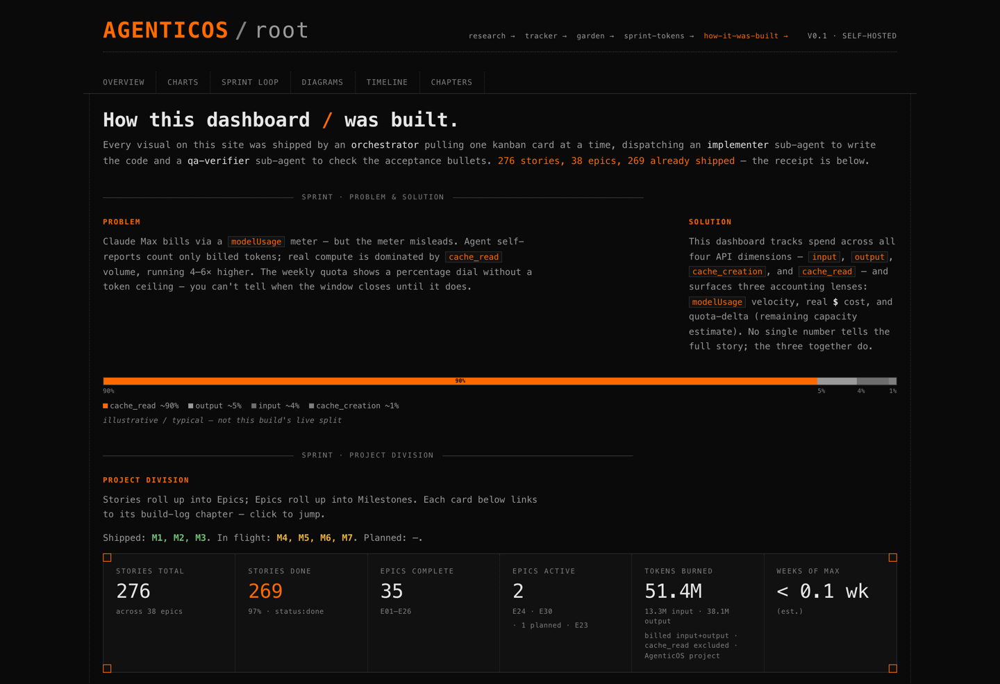

# AgenticOS PMO

This is the planning system that ran an AI-built product like a real one. Every page of
[agenticos.sethsendom.com](https://agenticos.sethsendom.com) was written by AI coding agents
pulling one kanban card at a time, directed by a product manager who writes no code by hand. The
cards, the estimates, the budgets and the accept-or-reject calls all live in this repo.

**150+ closed one-hour sprints · 275+ stories · 38 epics · 7 milestones.**
Counts as of September 2026; the live receipt at
[/how-it-was-built](https://agenticos.sethsendom.com/how-it-was-built) is the version that stays
current.

## What it is

An Obsidian vault, nothing more exotic than that. Markdown is the source of truth: one file per
story with structured front-matter, a five-column board, an epic and milestone tree, a file per
sprint, and a research ledger. Obsidian only renders those files. A Claude Code session reads and
writes the same ones, and a single JSON export feeds the public dashboard, which is how the site
can display its own build log.

## How work gets priced

Not in story points. A story is priced by the shape of the checks it has to pass, because that is
where the cost sits: a change needing a cold rebuild and a browser test run costs about the same
whether the diff is one line or fifty. Each sprint fits in an hour and commits to a short
must-ship list. Should-ship items get dropped without argument when the budget runs short, and
spend is checked at four points during the run. Every number in the estimate table was derived
from logged runs rather than guessed.

## What it measured

Four results from the ledger, including the ones that went against the tools doing the work.

- **An agent cannot see its own bill.** Sub-agents self-reported 14–22k tokens for work the meter
  priced at 85–98k, so all accounting moved outside the agent.
- **Prototyping first is the biggest cost lever.** Same session, same page shape: the prototyped
  one landed 95% under budget, the un-prototyped one 146% over.
- **Measuring the problem killed the fix.** A code-search index looked worth building until
  search and navigation measured about 8% of all tokens, roughly half the eyeball estimate. It
  was never built.
- **Delivery was predictable, cost was not.** 34 of 34 studied sprints shipped what they
  committed to, and 73.5% of them ran over the token budget, median +147%. The estimation model
  has been rebuilt three times from those misses.

## See it running

- [The dashboard](https://agenticos.sethsendom.com) and
  [how it was built](https://agenticos.sethsendom.com/how-it-was-built).
- The research pages:
  [tracker](https://agenticos.sethsendom.com/research/tracker),
  [explorer](https://agenticos.sethsendom.com/research/explorer),
  [garden](https://agenticos.sethsendom.com/research/garden),
  [sprint tokens](https://agenticos.sethsendom.com/research/sprint-tokens). Rejected findings are
  published next to the accepted ones.
- [agenticos](https://github.com/SethMK/agenticos), the product this workspace planned.

Code for both sits in a private repo. These two public repos carry the write-up and the screens.

Built by [Marcin Kokott](https://linkedin.com/in/marcinkokott).
